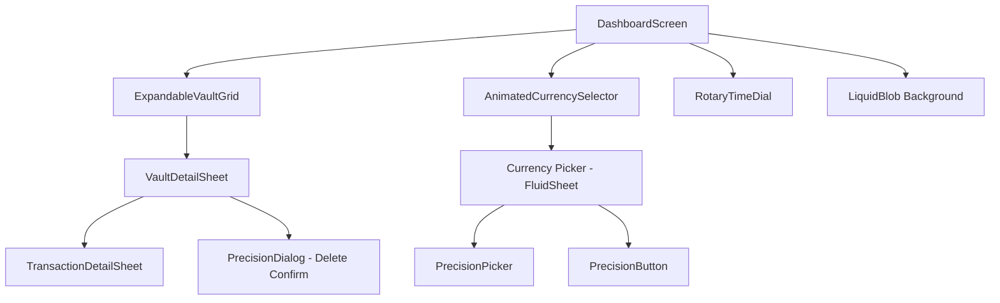
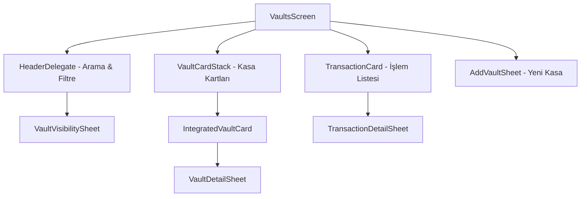
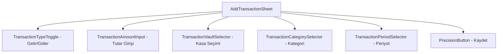
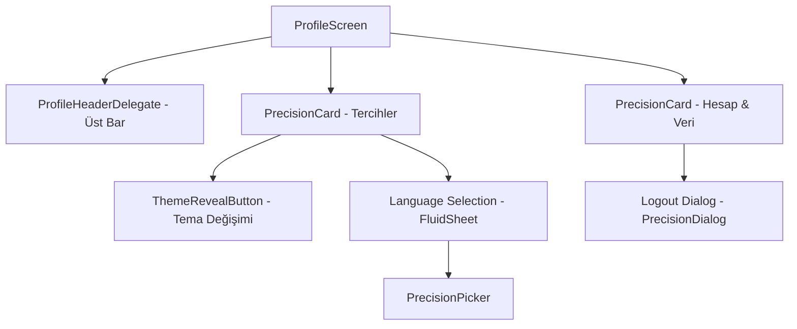
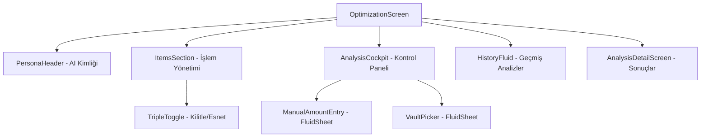

# 🗺️ FinCast Proje Yol Haritası & Mimari Dokümantasyonu

Bu belge, FinCast uygulamasının teknik yapısını, dosya hiyerarşisini ve bileşenler arası ilişkileri detaylandırmak için oluşturulmuştur.

---

## 1. Ana Ekran (Dashboard)
*   **Dosya:** `lib/features/dashboard/dashboard_screen.dart`
*   **Açıklama:** Uygulamanın merkezi kontrol paneli. Bakiye, kasalar ve zaman döngüsü burada yönetilir.

### 🌳 Hiyerarşi Ağacı

### 🧩 Modüler Bileşenler (Sub-Widgets)
| Bileşen | Dosya Yolu | Görevi |
| :--- | :--- | :--- |
| **Kasalar Izgarası** | `lib/features/dashboard/widgets/expandable_vault_grid.dart` | Kasaları ana ekranda şık kartlar halinde listeler. |
| **Zaman Kadranı** | `lib/features/dashboard/widgets/rotary_time_dial.dart` | Zamanı ileri/geri sararak simülasyon yapmayı sağlar. |
| **Bakiye Seçici** | `lib/features/dashboard/dashboard_screen.dart` (Inline) | Toplam bakiyeyi gösterir ve para birimi seçimini tetikler. |
| **Sıvımsı Blob** | `lib/features/dashboard/dashboard_screen.dart` (Inline) | Arka planda süzülen organik görsel efektler. |

### 📑 Bağlı Açılır Ekranlar (Sheets) & Diyaloglar
| Ekran | Yapı | Görevi |
| :--- | :--- | :--- |
| **Para Birimi Seçici** | `FluidSheet` + `PrecisionPicker` | Uygulama genelindeki para birimi simgesini değiştirir. |
| **Kasa Detay Sayfası** | `VaultDetailSheet` | Kasa içindeki işlemleri listeler ve düzenleme imkanı sunar. |

### 🛠️ Kullanılan Temel Bileşenler (Shared)
*   [fluid_sheet.dart](file:///c:/Users/Yasir2.Prenses/FinCast/lib/shared/widgets/fluid_sheet.dart)
*   [precision_picker.dart](file:///c:/Users/Yasir2.Prenses/FinCast/lib/shared/widgets/precision_picker.dart)
*   [precision_button.dart](file:///c:/Users/Yasir2.Prenses/FinCast/lib/shared/widgets/precision_button.dart)

---

## 2. Kasalar Sayfası (Vault Management)
*   **Dosya:** `lib/features/vaults/vaults_screen.dart`
*   **Açıklama:** Tüm kasaların listelendiği, filtrelendiği ve yönetildiği ana liste ekranı.

### 🌳 Hiyerarşi Ağacı

### 🧩 Modüler Bileşenler (Sub-Widgets)
| Bileşen | Dosya Yolu | Görevi |
| :--- | :--- | :--- |
| **Başlık Alanı** | `.../widgets/header_delegate.dart` | Arama, filtreleme ve sayfa başlığını yönetir. |
| **Kasa Kartları** | `.../widgets/integrated_vault_card.dart` | Kasaların bakiye ve bilgilerini gösteren ana kartlar. |
| **İşlem Kartı** | `.../widgets/transaction_card.dart` | Harcama veya gelir işlemlerini listeleyen satırlar. |
| **Kasa Yığını** | `.../widgets/vault_card_stack.dart` | Kasaları şık bir yığın halinde üst üste dizer. |

### 📑 Bağlı Açılır Ekranlar (Sheets) & Diyaloglar
| Ekran | Yapı | Görevi |
| :--- | :--- | :--- |
| **Yeni Kasa Ekle** | `AddVaultSheet` | Kullanıcının yeni bir kasa/cüzdan oluşturmasını sağlar. |
| **Kasa Görünürlüğü** | `VaultVisibilitySheet` | Hangi kasaların bakiye toplamına dahil olacağını seçtirir. |
| **Kasa Detayı** | `VaultDetailSheet` | Kasa özelindeki işlemleri ve ayarları gösterir. |
| **İşlem Detayı** | `TransactionDetailSheet` | Seçili işlemin tüm detaylarını gösterir. |
| **Silme Onayı** | `PrecisionDialog` | Kasa veya işlem silerken onay alır. |

### 🛠️ Kullanılan Temel Bileşenler (Shared)
*   [fluid_animated_icon.dart](file:///c:/Users/Yasir2.Prenses/FinCast/lib/shared/widgets/fluid_animated_icon.dart)
*   [precision_dialog.dart](file:///c:/Users/Yasir2.Prenses/FinCast/lib/shared/widgets/precision_dialog.dart)
*   [fluid_sheet.dart](file:///c:/Users/Yasir2.Prenses/FinCast/lib/shared/widgets/fluid_sheet.dart)

---

## 3. İşlem Ekleme Sayfası (Add Transaction)
*   **Dosya:** `lib/features/transactions/add_transaction_sheet.dart`
*   **Açıklama:** Yeni gelir veya gider kayıtlarının oluşturulduğu dinamik form ekranı.

### 🌳 Hiyerarşi Ağacı

### 🧩 Modüler Bileşenler (Sub-Widgets)
| Bileşen | Dosya Yolu | Görevi |
| :--- | :--- | :--- |
| **Tür Seçici** | `.../widgets/transaction_type_toggle.dart` | Gelir ve Gider tabları arası geçiş. |
| **Tutar Girişi** | `.../widgets/transaction_amount_input.dart` | Tekli veya Esnek tutar girişi. |
| **Kasa Seçici** | `.../widgets/transaction_vault_selector.dart` | İşlemin ait olduğu kasayı belirler. |
| **Kategori Seçici** | `.../widgets/transaction_category_selector.dart` | Kategori listesi ve animasyonu. |
| **Periyot Seçici** | `.../widgets/transaction_period_selector.dart` | Tekrarlanma sıklığı ayarı. |

### 📑 Bağlı Açılır Ekranlar (Sheets) & Diyaloglar
| Ekran | Yapı | Görevi |
| :--- | :--- | :--- |
| **Kasa Seçici (Sheet)** | `PrecisionPicker` | Kasa seçimi için açılan döner panel. |
| **Periyot Seçici (Sheet)** | `PrecisionPicker` | Özel gün/tarih seçimi için açılan panel. |

### 🛠️ Kullanılan Temel Bileşenler (Shared)
*   [precision_picker.dart](file:///c:/Users/Yasir2.Prenses/FinCast/lib/shared/widgets/precision_picker.dart)
*   [fluid_switch.dart](file:///c:/Users/Yasir2.Prenses/FinCast/lib/shared/widgets/fluid_switch.dart)
*   [precision_button.dart](file:///c:/Users/Yasir2.Prenses/FinCast/lib/shared/widgets/precision_button.dart)

---

## 4. Profil & Ayarlar (Profile & Settings)
*   **Dosya:** `lib/features/profile/profile_screen.dart`
*   **Açıklama:** Kullanıcı tercihleri, tema yönetimi ve abonelik bilgilerinin yer aldığı ayarlar sayfası.

### 🌳 Hiyerarşi Ağacı

### 🧩 Modüler Bileşenler (Sub-Widgets)
| Bileşen | Dosya Yolu | Görevi |
| :--- | :--- | :--- |
| **Profil Başlığı** | `.../profile_screen.dart` (Delegate) | Scroll ile küçülen, PRO durumu gösteren dinamik alan. |
| **Ayar Kartları** | `lib/shared/widgets/precision_card.dart` | Ayarların gruplandığı, cam efektli kart yapısı. |
| **Tema Butonu** | `.../widgets/theme_reveal_button.dart` | Temayı dairesel animasyonla değiştiren özel buton. |

### 📑 Bağlı Açılır Ekranlar (Sheets) & Diyaloglar
| Ekran | Yapı | Görevi |
| :--- | :--- | :--- |
| **Dil Seçimi** | `FluidSheet` + `PrecisionPicker` | Uygulama dilini değiştirmek için açılan panel. |
| **Hesap İşlemleri** | `PrecisionDialog` | Çıkış yapma veya hesap silme onay diyalogları. |

### 🛠️ Kullanılan Temel Bileşenler (Shared)
*   [theme_reveal_button.dart](file:///c:/Users/Yasir2.Prenses/FinCast/lib/shared/widgets/theme_reveal_button.dart)
*   [precision_card.dart](file:///c:/Users/Yasir2.Prenses/FinCast/lib/shared/widgets/precision_card.dart)
*   [precision_clickable.dart](file:///c:/Users/Yasir2.Prenses/FinCast/lib/shared/widgets/precision_clickable.dart)

---

## 5. Optimizasyon & AI Analiz (Optimization & AI Analysis)
*   **Dosya:** `lib/features/optimization/optimization_screen.dart`
*   **Açıklama:** AI destekli finansal koçluk, hedef planlama ve harcama optimizasyonu ekranı.

### 🌳 Hiyerarşi Ağacı

### 🧩 Modüler Bileşenler (Sub-Widgets)
| Bileşen | Dosya Yolu | Görevi |
| :--- | :--- | :--- |
| **Analiz Kokpiti** | `.../optimization_screen.dart` (Cockpit) | Hedef tutar, tarih ve kasa seçimini yöneten interaktif panel. |
| **Üçlü Toggle** | `.../optimization_screen.dart` (Toggle) | İşlemleri AI için "Kilitli", "Normal" veya "Esnek" yapar. |
| **AI Kimliği** | `.../optimization_screen.dart` (Persona) | Kullanıcının finansal karakterini özetleyen AI alanı. |
| **Sonuç Ekranı** | `lib/features/optimization/analysis_detail_screen.dart` | Analiz sonuçlarını ve AI tavsiyelerini gösterir. |

### 📑 Bağlı Açılır Ekranlar (Sheets) & Diyaloglar
| Ekran | Yapı | Görevi |
| :--- | :--- | :--- |
| **Hedef Girişi** | `FluidSheet` + `TextField` | Manuel hedef tutar girişi için açılan panel. |
| **Kapsam Seçici** | `FluidSheet` + `ListTile` | Analize dahil edilecek kasaların seçimi. |
| **PRO Yükseltme** | `ProUpgradeSheet` | AI özelliklerine erişim için abonelik ekranı. |

### 🛠️ Kullanılan Temel Bileşenler (Shared)
*   [premium_glass_card.dart](file:///c:/Users/Yasir2.Prenses/FinCast/lib/shared/widgets/premium_glass_card.dart)
*   [membership_orb.dart](file:///c:/Users/Yasir2.Prenses/FinCast/lib/shared/widgets/membership_orb.dart)
*   [fluid_button.dart](file:///c:/Users/Yasir2.Prenses/FinCast/lib/shared/widgets/fluid_button.dart)

---

**© 2026 FinCast Technical Documentation**
