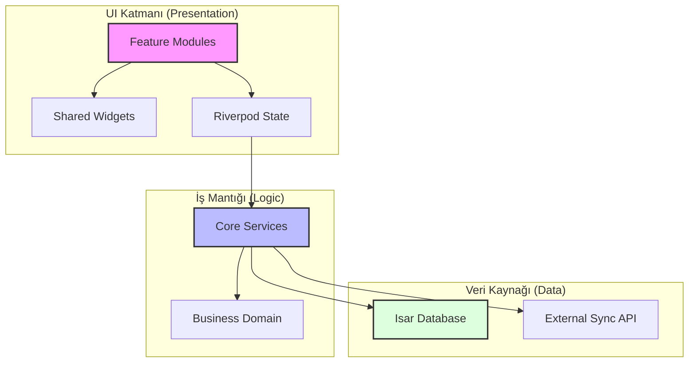

# 🌐 FinCast Proje Haritası & Mimari Yapı

FinCast, modern Flutter prensipleri üzerine inşa edilmiş, **Fluid & Glassmorphism** tasarım dilini benimseyen bir finansal yönetim aracıdır. Bu harita, projenin teknik hiyerarşisini ve modüler yapısını görselleştirir.

---

## 🏗 Mimari Akış (Architecture)

Aşağıdaki diyagram, uygulamanın katmanları arasındaki veri akışını ve etkileşimi temsil eder:

---

## 📋 Özellik Matrisi (Feature Matrix)

Uygulamanın ana modülleri ve görevleri aşağıdaki tabloda özetlenmiştir:

| Modül 🧩 | Görev & Sorumluluk 🛠 | Anahtar Bileşenler ✨ |
| :--- | :--- | :--- |
| **Dashboard** | Genel finansal durum ve akışlar | `VaultCardStack`, `RotaryTimeDial` |
| **Vaults** | Nakit havuzları ve kasa yönetimi | `VaultManagementSheet`, `IsarDB` |
| **Transactions** | Gelir/Gider kayıt ve düzenleme | `AddTransactionSheet`, `FluidNumpad` |
| **Subscription** | Premium üyelik ve kısıtlamalar | `ProUpgradeSheet`, `MembershipOrb` |
| **Auth** | Kullanıcı güvenliği ve senkronizasyon | `AuthService`, `SyncService` |
| **Optimization** | AI tabanlı analiz ve öneriler | `AI_InsightCard`, `OptimizationEngine` |

---

## 🗂 Klasör Hiyerarşisi

### 📦 core/ (Çekirdek)
- `database/` – **Isar DB** şemaları ve CRUD servisleri.
- `services/` – Bağımsız servisler (Auth, Sync, Sub).
- `providers/` – Global state sağlayıcıları (Riverpod).
- `theme/` – Tasarım sistemi tanımları (Colors, Typography).

### ✨ features/ (Özellikler)
Her özellik kendi içinde **screens** ve **widgets** olarak bölünür.
- `dashboard/` – Kart destesi ve zaman seçici odaklı ana sayfa.
- `vaults/` – Grup ve kasa detayları.
- `subscription/` – Gold plan ve "Membership Orb" deneyimi.

### 🍱 shared/ (Ortak)
- **Fluid & Glass Components:**
    - `fluid_button.dart` – Dokunsal tepki (haptic) destekli buton.
    - `fluid_container.dart` – Dinamik cam efekti ve gölge derinliği.
    - `membership_orb.dart` – Animasyonlu premium durum göstergesi.

---

> [!IMPORTANT]
> **Tasarım Felsefesi:** Uygulama genelinde "Sıvı (Fluid)" geçişler ve "Cam (Glass)" dokular ön plandadır. Yeni widget eklerken `shared/fluid_*` standartlarını kullanmaya özen gösterin.

> [!TIP]
> **Veri Güvenliği:** Tüm yerel veriler `Isar` ile şifrelenmiş veya güvenli alanda tutulur. Senkronizasyon işlemleri `SyncService` üzerinden kontrollü yapılır.
